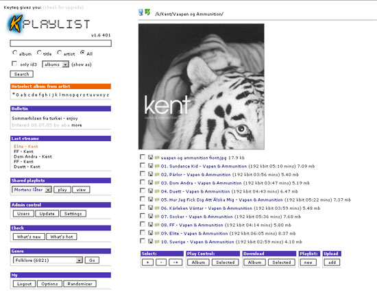

kPlaylist is a music database that you manage via the web. With kPlaylist you can stream your music (ogg, mp3, wav, wma, etc.), you can upload, make playlists, share, search, download and a lot more.

  

### Updates

* PHP 8 support is here!

### Project History

| Date | Description |
| ---- | ----------- |
| **02 Feb 2002** | **kPlaylist 0.9b (first release)** |
| 14 Apr 2002 | kPlaylist 1.0 |
| 1 May 2002 | kPlaylist 1.1 |
| 10 July 2002 | kPlaylist 1.2 |
| 25 July 2002 | kPlaylist 1.3 |
| 26 September 2004 | kPlaylist 1.4 |
| 26 December 2004 | kPlaylist 1.5 |
| 3 August 2005 | kPlaylist 1.6 |
| 19 May 2006 | kPlaylist 1.7 |
| 20 May 2008 | kPlaylist 1.8 |
| 14 August 2014 | PHP 5.3 end of life |
| **20 March 2015** | **kPlaylist 1.8 build 512 released (final build)** |
| 3 December 2015 | PHP 7.0 released |
| **2017-2021** | **Maintenance updates to run on PHP 7.x** |
| 31 December 2018 | PHP 5.6 end of life |
| 26 November 2020 | PHP 8.0 released |
| 28 November 2021 | PHP 7.4 end of active support |
| 28 November 2022 | PHP 7.4 end of security support |
| **August 2026**   | **Maintenance updates to run on PHP 8.x and MySQL 8** |
| 31 December 2027 | PHP 8.5 end of active support |
| 31 December 2029 | PHP 8.5 end of security support |

See [releases page](https://github.com/dysproseum/kplaylist-php7/releases) for past releases.

---

### Customization

The goal of this project has always been to keep the original software running on modern platforms, only making changes necessary for PHP compatibility.

However, new functionality can be added with themes:

  - By default, kPlaylist creates **M3U playlists** that open in a media player like Winamp or VLC, as well as support for a flash player or jwplayer.
  - To enable **native playback in the browser**, the `html5_player` or `webamp` themes can be set per-user under My -> Options -> Style.

It's now easier to use kPlaylist from mobile devices (because I also use this in the car!)

  - The mobile layout has been created for widths less than 768px.
  - This requires setting `mobile.css` as the "Mobile CSS" value.

You can find these options under Admin control -> Settings -> Customize.

---

### Installing kPlaylist

You will want to have a web server such as Apache or nginx, as well as a MySQL server already installed.

The current main branch has been tested with the following versions:
- Apache 2.4.66 :heavy_check_mark:
- PHP 8.4.5 :heavy_check_mark:
- MySQL 8.4.10 :heavy_check_mark:

The web server can be configured to run either from the document root (ex. http://localhost:8080/) or under a directory path (ex. http://localhost:8080/kplaylist/)

Copy the `example.kpconfig.php` to `kpconfig.php` to place the database credentials. Otherwise, these can be entered in the installation wizard and kPlaylist will attempt to create the file.

Upon first load in the browser, you are greeted with installation options.

#### Create new database:

- This option will attempt to create a database and user for kPlaylist using the root MySQL user (root credentials are not stored)
- If this does not work, you will instead need to create the database and user manually
- Put settings in `kpconfig.php` and restart the installation using Existing Database

#### Existing Database:

- This option will assume the MySQL user and database have already been created
- Confirm the credentials are correct
- If this does not work, confirm you can connect to the MySQL server from the web server

#### First login:

- The user `admin` is created with password set to `admin`
- **Make sure to change the password using My -> Options in the left sidebar**

#### Next steps:
- Point to the directory where kPlaylist can find your music
- Under Admin control -> Settings -> File handling, enter the directory path and click Save
- Start the music crawl from Admin control -> Update

Have fun listening to your music via the web ;-)

---

### More Resources

Forum: https://groups.google.com/d/forum/kplaylist
